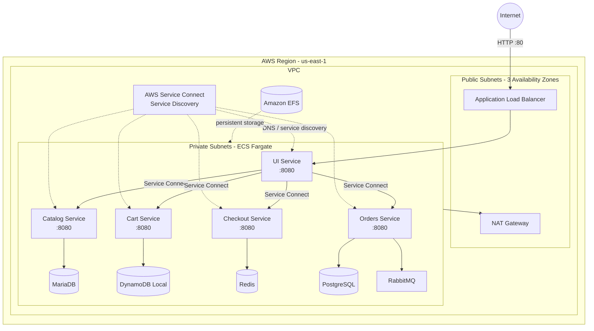
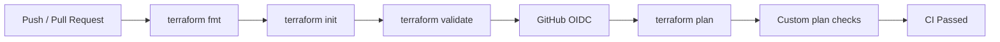

# AWS Cloud-Native Retail Platform

Infrastructure-as-code deployment of a multi-service retail application on AWS using **Terraform**, **Amazon ECS Fargate**, **Application Load Balancer**, **AWS Service Connect**, and **GitHub Actions**.

The project focuses on designing and operating the cloud infrastructure around a containerized microservices application: networking, service discovery, task orchestration, stateful sidecars, health checks, security groups, and Terraform CI.

> This repository focuses on the AWS infrastructure and deployment architecture for the retail workload rather than the application source code itself.

---

## Architecture



## Deployment Metrics

The current AWS deployment provisions a multi-service environment across three Availability Zones using Terraform.

| Metric | Current Deployment |
|---|---:|
| AWS Availability Zones | 3 |
| ECS application services | 5 |
| Supporting data / messaging containers | 5 |
| Private backend services | 4 |
| Public application entry points | 1 ALB |
| Full infrastructure provisioning time | ~5 minutes |
| Infrastructure definition | Terraform |
| Internal service communication | AWS Service Connect |

A complete environment can be recreated from Terraform in approximately **5 minutes**, including VPC networking, public/private subnets, ECS Fargate services, load balancing, service discovery, security groups, EFS, and supporting container dependencies.

> Provisioning time is based on observed end-to-end `terraform apply` runs and is intended as an approximate deployment metric rather than a performance benchmark.

### Request flow

```text
Client
  │
  ▼
Application Load Balancer
  │
  ▼
UI ECS Service
  │
  ├── catalog:8080
  ├── cart:8080
  ├── checkout:8080
  └── orders:8080
        │
        ├── PostgreSQL
        └── RabbitMQ
```

Only the UI is exposed through the public load balancer. Backend services remain inside the VPC and communicate through **AWS Service Connect**.

---

## Infrastructure Highlights

### Networking

The infrastructure creates a custom VPC distributed across **three Availability Zones**.

It includes:

- Public subnets for internet-facing infrastructure
- Private subnets for ECS workloads
- Internet Gateway
- NAT Gateway for private subnet outbound connectivity
- Public and private route tables
- Security groups controlling ALB, ECS, and EFS traffic

The public Application Load Balancer accepts HTTP traffic on port `80`, while application containers communicate internally on port `8080`.

---

### Container Orchestration

The application runs on **Amazon ECS with AWS Fargate**, removing the need to manage EC2 container hosts.

The deployed application is split into five services:

| Service | Purpose | Supporting dependency |
|---|---|---|
| `ui` | Frontend / application entry point | — |
| `catalog` | Product catalog | MariaDB |
| `cart` | Shopping cart | DynamoDB Local |
| `checkout` | Checkout workflow | Redis |
| `orders` | Order processing | PostgreSQL + RabbitMQ |

Each service is defined using ECS task definitions stored under:

```text
task-definitions/
```

Stateful dependencies are colocated with their corresponding application service as sidecar containers for this deployment.

---

## Service Discovery

Backend communication uses **AWS Service Connect**.

The UI communicates with internal services using stable logical names such as:

```text
http://catalog:8080
http://cart:8080
http://checkout:8080
http://orders:8080
```

This avoids exposing backend services publicly or depending on task IP addresses.

The ECS service security group allows internal service-to-service traffic while the ALB security group only forwards external traffic to the application layer.

---

## Infrastructure as Code

All AWS infrastructure is defined using Terraform.

The project provisions resources including:

- VPC
- Public and private subnets
- Internet Gateway
- NAT Gateway
- Route tables
- Security groups
- ECS cluster
- ECS task definitions
- ECS services
- AWS Service Connect namespace
- Application Load Balancer
- Target groups and listener
- Amazon EFS
- EFS mount targets

Terraform configuration is divided into a few primary files:

```text
.
├── .github/
│   └── workflows/
│       └── terraform-ci.yml
│
├── task-definitions/
│   ├── cart-db.json
│   ├── cart-service.json
│   ├── catalog-db.json.tftpl
│   ├── catalog-service.json.tftpl
│   ├── checkout-db.json
│   ├── checkout-service.json
│   ├── order-db.json.tftpl
│   ├── order-service.json.tftpl
│   ├── orders-rabbitmq.json.tftpl
│   └── ui-service.json
│
├── locals.tf
├── microservices.tf
├── resources.tf
├── variables.tf
├── outputs.tf
├── version.tf
├── terraform.tfvars.example
└── docker-compose.yaml
```

---

## CI Pipeline

Terraform changes are automatically checked using **GitHub Actions**.



The workflow performs:

```text
terraform fmt -check -recursive
        ↓
terraform init -backend=false
        ↓
terraform validate
        ↓
AWS authentication through GitHub OIDC
        ↓
terraform plan
        ↓
custom plan validation
```

The workflow currently checks the generated Terraform plan for previously encountered invalid ECS/Fargate configurations such as:

- unsupported Fargate Linux capabilities
- invalid ECS health-check intervals
- stale or incorrect volume references

### AWS authentication

GitHub Actions authenticates to AWS using **OpenID Connect (OIDC)** instead of storing long-lived AWS access keys.

The workflow assumes a dedicated IAM role with read-only permissions for Terraform planning.

```text
GitHub Actions
      │
      │ OIDC token
      ▼
AWS IAM Identity Provider
      │
      ▼
Terraform Plan IAM Role
      │
      ▼
AWS Read-Only API Access
```

---

## Running the Infrastructure

### Prerequisites

You will need:

- Terraform
- AWS CLI
- An AWS account
- AWS credentials configured locally

### 1. Clone the repository

```bash
git clone https://github.com/Clydie-Juls/aws-cloud-native-retail-platform.git
cd aws-cloud-native-retail-platform
```

### 2. Create your variable file

```bash
cp terraform.tfvars.example terraform.tfvars
```

Update the values as needed.

Do not commit `terraform.tfvars` if it contains sensitive values.

### 3. Initialize Terraform

```bash
terraform init
```

### 4. Format and validate

```bash
terraform fmt
terraform validate
```

### 5. Review the plan

```bash
terraform plan
```

### 6. Deploy

```bash
terraform apply
```

After deployment, Terraform outputs can be used to retrieve the infrastructure endpoints.

### 7. Destroy when finished

This project provisions AWS resources that may incur cost, including an Application Load Balancer and NAT Gateway.

```bash
terraform destroy
```

---

## Design Decisions

### Private backend services

Only the UI service is exposed through the Application Load Balancer.

Backend services remain private and are accessed through Service Connect, reducing the public attack surface and keeping east-west application traffic inside the VPC.

### Fargate

Fargate was used to run ECS tasks without provisioning or maintaining EC2 container hosts.

### Sidecar data services

For the current learning and demonstration environment, application-specific databases and messaging components run alongside their corresponding application containers.

This simplifies deployment but would likely be replaced with managed services such as Amazon RDS, DynamoDB, ElastiCache, and Amazon MQ in a production architecture.

### Terraform templates

Service definitions that require runtime Terraform values, such as database credentials, use `.json.tftpl` templates.

Static container definitions remain regular JSON files.

---

## What I Learned

Building this project involved debugging infrastructure across several layers, including:

- VPC subnet and CIDR design
- public vs. private routing
- NAT and Internet Gateway routing
- ECS Fargate task restrictions
- ECS task-definition health checks
- Service Connect port mappings and service discovery
- security-group relationships
- container startup dependencies
- EFS mount configuration
- Terraform state and sensitive values
- GitHub Actions CI
- AWS IAM and GitHub OIDC federation

Several issues only became visible when moving from a local AWS emulator to an actual AWS deployment, which made the project particularly useful for understanding the differences between infrastructure configuration and real cloud runtime behavior.

---

## Current Status

The infrastructure has been successfully deployed on AWS and the application has been tested through the public Application Load Balancer.

Current development priorities include:

- architecture documentation
- observability and centralized logging
- stronger Terraform policy checks
- remote Terraform state
- managed database alternatives
- CI/CD deployment workflows
- improved least-privilege IAM policies

---

## Technologies


**AWS:** ECS, Fargate, VPC, ALB, EFS, IAM, Service Connect, Cloud Map  
**Infrastructure:** Terraform  
**Containers:** Docker  
**CI:** GitHub Actions  
**Authentication:** GitHub OIDC → AWS IAM

---

## Future Improvements

This project is still evolving. Potential improvements include:

- CloudWatch centralized logging and metrics
- ECS autoscaling
- HTTPS with ACM
- Route 53 DNS
- remote Terraform state with locking
- separate dev/staging environments
- least-privilege IAM policies
- managed persistence services
- automated deployment after manual approval
- infrastructure tests and policy-as-code

---

## Disclaimer

This project is intended for learning, experimentation, and portfolio demonstration.

The deployed application workload is based on existing containerized retail sample services; this repository primarily represents the AWS infrastructure, Terraform configuration, deployment architecture, and CI work surrounding those services.